# EduTurmas

Protótipo mobile em Flutter para gestão de turmas, avaliações e correção de
provas. A primeira entrega prioriza a interface, a navegação entre telas e o
uso de dados simulados.

## Fluxos disponíveis

- Login, cadastro e recuperação de senha.
- Painel inicial com atalhos para turmas e avaliações.
- Listagem de turmas, alunos e provas com dados mockados.
- Avaliações recentes com filtros por status.
- Criação de uma nova avaliação como rascunho.
- Detalhes da avaliação e configuração visual do gabarito.
- Acesso direto à correção e simulação da leitura de QR Code.
- Estatísticas gerais por turma e estatísticas detalhadas de cada prova
  (acerto médio, questão mais errada e acertos por questão).
- Geração de relatório de desempenho com prévia simulada em PDF.
- Demonstração dos estados vazio e de erro nas telas de avaliações e de
  estatísticas.

## Prints das telas

Capturas reais do app rodando, uma por fluxo principal:

|                                                                      |                                                           |                                                                    |
| -------------------------------------------------------------------- | --------------------------------------------------------- | ------------------------------------------------------------------ |
| **Login**                                                            | **Cadastro**                                              | **Redefinir senha**                                                |
| 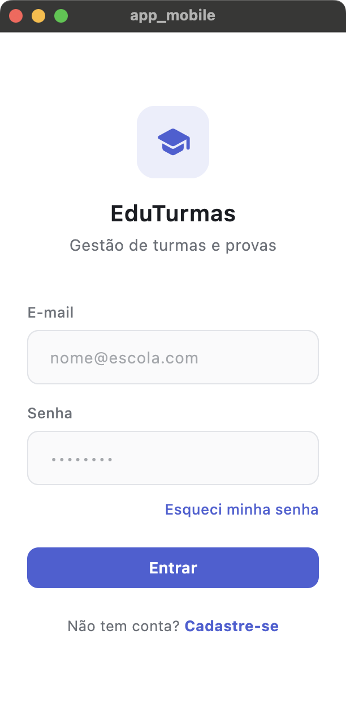                              | 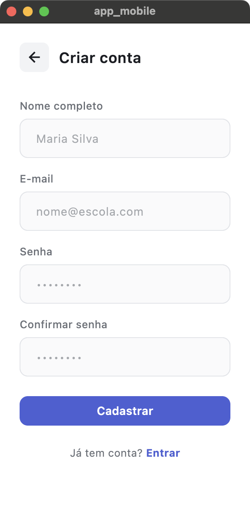             | 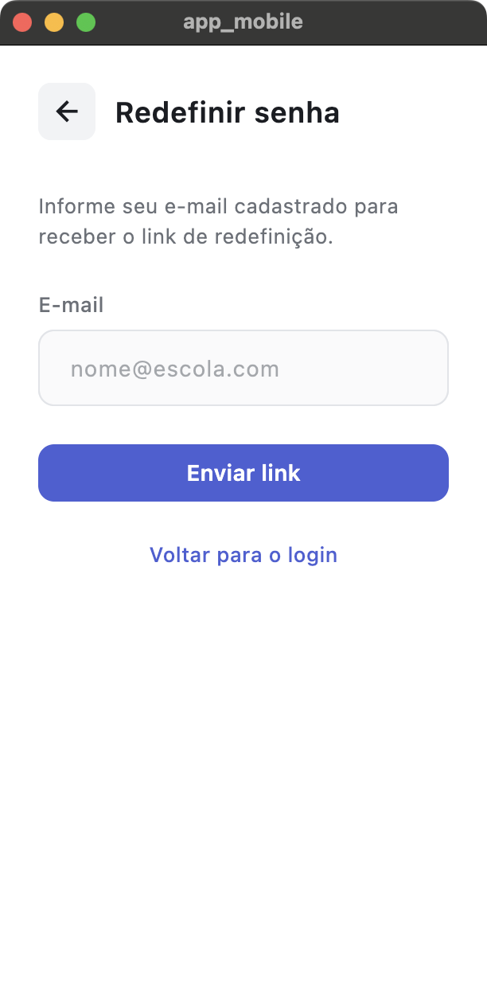        |
| **Painel inicial**                                                   | **Turmas**                                                | **Detalhe da turma**                                               |
| 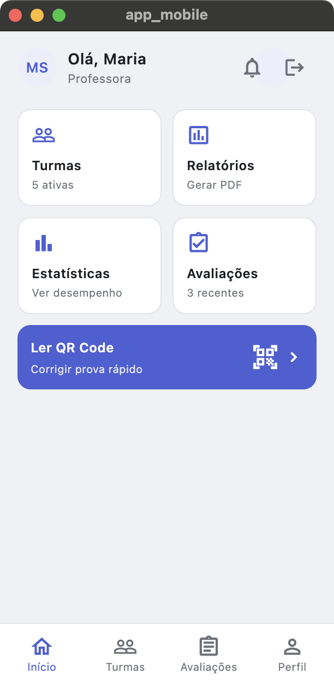                      | 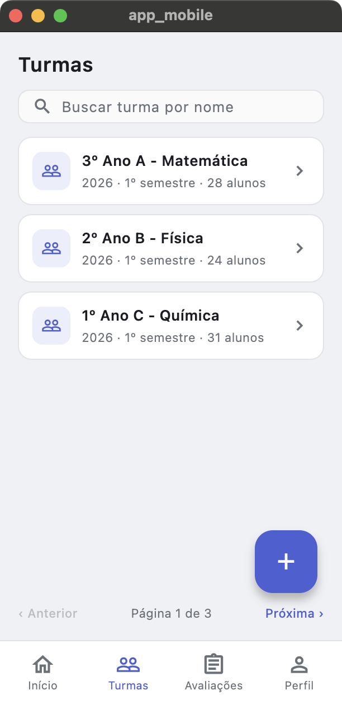                 |          |
| **Avaliações**                                                       | **Nova avaliação**                                        | **Detalhe da avaliação**                                           |
|                     | 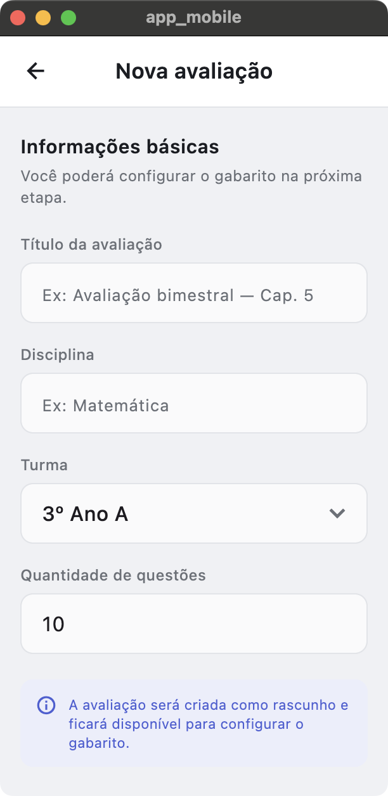 | 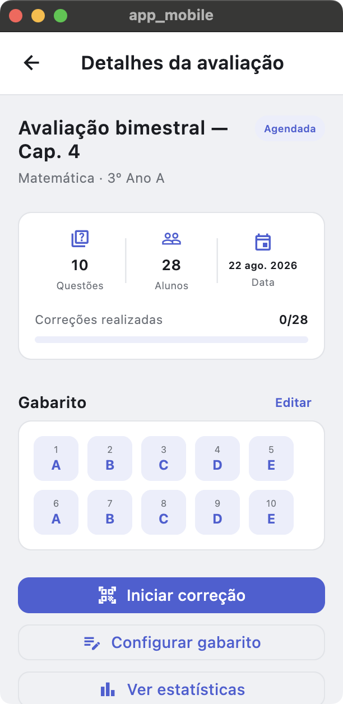 |
| **Configurar gabarito**                                              | **Iniciar correção**                                      | **Estatísticas gerais**                                            |
| 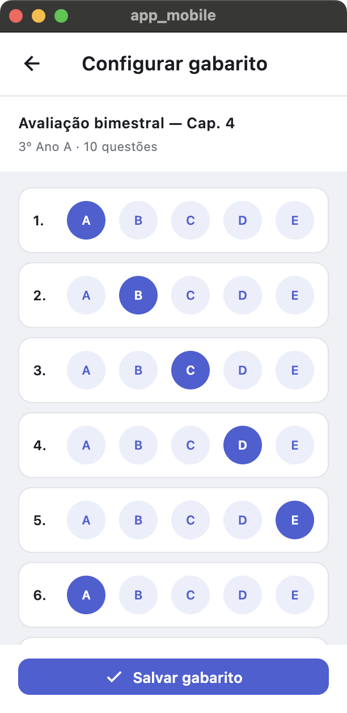                        | 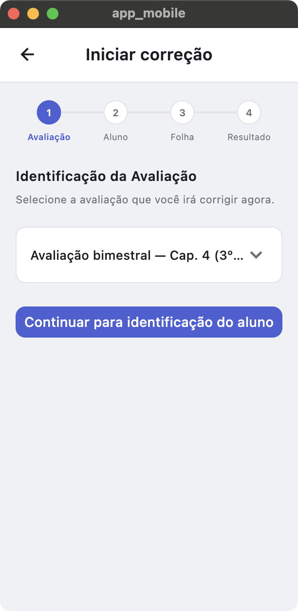             | 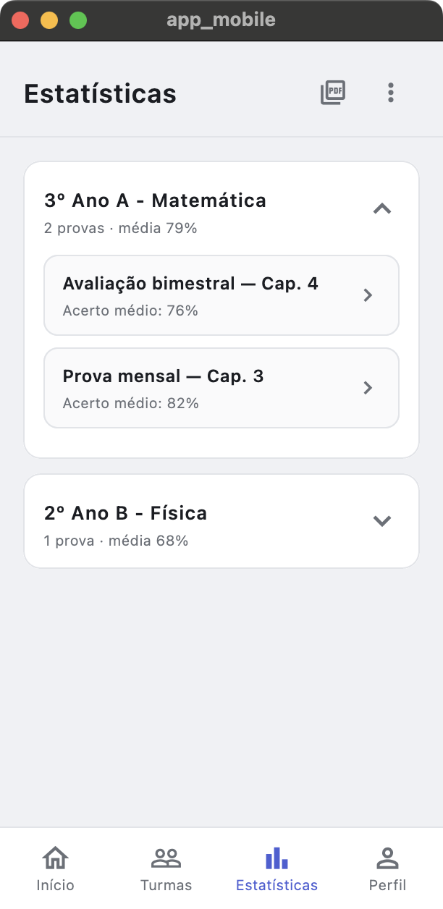              |
| **Estatísticas da prova**                                            | **Relatório (PDF)**                                       |                                                                    |
| 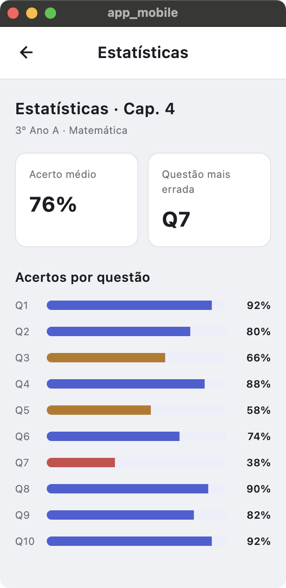 | 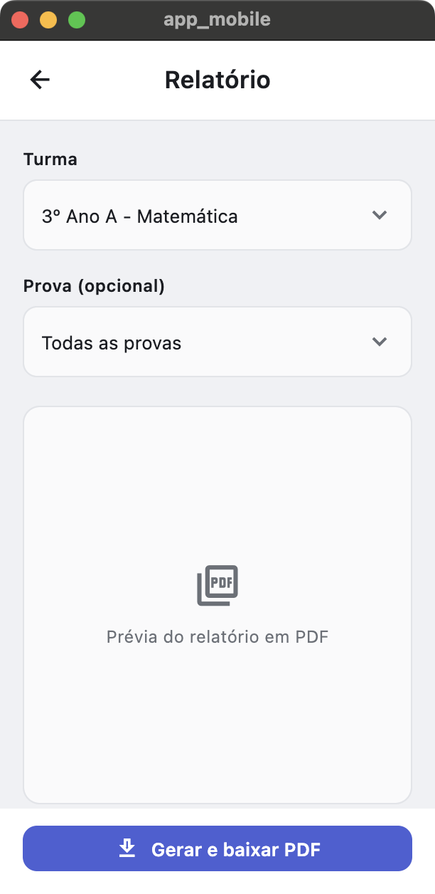           |                                                                    |

## Requisitos funcionais explícitos

- **Autenticação**: o sistema deve permitir login com e-mail e senha,
  cadastro de nova conta e recuperação de senha via envio de link para o
  e-mail informado.
- **Logout**: o usuário deve poder encerrar a sessão a partir do painel
  inicial, retornando à tela de login.
- **Painel inicial (dashboard)**: deve exibir atalhos para Turmas,
  Relatórios, Estatísticas e Avaliações, além de um atalho para leitura de
  QR Code.
- **Gestão de turmas**: o sistema deve permitir listar turmas cadastradas,
  buscar turma por nome, criar uma nova turma (descrição, semestre e ano) e
  navegar entre páginas da listagem.
- **Gestão de alunos**: dentro de uma turma, deve ser possível listar os
  alunos matriculados e adicionar um novo aluno.
- **Gestão de avaliações**: o sistema deve permitir listar avaliações,
  filtrar por status (rascunho, agendada, concluída), criar uma nova
  avaliação (vinculada a uma turma, salva como rascunho) e visualizar seus
  detalhes.
- **Gabarito**: deve ser possível configurar/visualizar o gabarito de uma
  avaliação, com uma alternativa marcada como correta por questão, e salvar
  as alterações.
- **Correção de provas**: o sistema deve guiar o usuário por um fluxo em
  etapas (avaliação → aluno → leitura da folha → resultado), simulando a
  leitura via QR Code/câmera e calculando o resultado (acertos) ao final.
- **Estatísticas**: o sistema deve exibir estatísticas gerais por turma
  (lista de provas com acerto médio) e estatísticas detalhadas de uma prova
  específica (acerto médio geral, questão com menor índice de acerto e
  percentual de acerto por questão).
- **Relatórios**: deve ser possível selecionar turma e, opcionalmente, uma
  prova específica, visualizar uma prévia e gerar um relatório em PDF.
- **Estados de carregamento, vazio e erro**: as telas de Avaliações e de
  Estatísticas devem ser capazes de representar, além do conteúdo normal, um
  estado vazio (sem itens) e um estado de erro, com opção de tentar
  novamente.

## Requisitos não funcionais explícitos

- **Plataforma**: aplicativo mobile multiplataforma construído com Flutter
  (SDK Dart `^3.13.1`), com suporte de build para Android, iOS, web, Linux,
  macOS e Windows conforme os diretórios de plataforma do projeto.
- **Dados simulados**: nesta etapa todos os dados (turmas, alunos,
  avaliações, estatísticas, resultado de correção, PDF) são mockados em
  memória (`lib/data`); não há persistência real nem integração com
  backend.
- **Consistência visual**: a interface segue uma paleta e um conjunto de
  componentes padronizados (`lib/theme/app_colors.dart`), reaproveitados em
  todas as telas para manter identidade visual única.
- **Responsividade de interação**: as listas (turmas, alunos, avaliações,
  questões) devem rolar corretamente e os formulários devem tratar o
  teclado virtual sem cobrir os campos em edição.
- **Qualidade de código**: o projeto deve manter zero problemas relatados
  por `flutter analyze`, seguindo as regras de `package:flutter_lints`
  definidas em `analysis_options.yaml`.
- **Testabilidade**: o projeto deve possuir testes automatizados
  (`flutter test`) cobrindo ao menos os modelos/telas críticos (ver
  `test/`).
- **Idioma**: toda a interface é em português do Brasil (pt-BR).
- **Sem dependências externas de terceiros para o core**: além dos pacotes
  padrão do Flutter (`cupertino_icons`), a primeira entrega não introduz
  bibliotecas externas para câmera, OCR, geração real de PDF ou leitura de
  QR Code — esses comportamentos são simulados na própria UI.

## Escopo delimitado

Fazem parte desta entrega:

- Interface completa e navegação entre as telas de autenticação, painel,
  turmas, alunos, avaliações, gabarito, correção (simulada), estatísticas e
  relatório.
- Estados de conteúdo, vazio, erro e feedbacks de ação (via `SnackBar`) para
  as principais interações.
- Dados fixos/mockados representando cenários de uso (turmas, alunos,
  avaliações e estatísticas de exemplo).

Não fazem parte desta entrega (fora de escopo):

- Integração com backend, API ou banco de dados real — toda a
  persistência é simulada em memória e é perdida ao reiniciar o app.
- Autenticação real (validação de credenciais, tokens, recuperação de senha
  por e-mail de fato) — os fluxos de login/cadastro/recuperação apenas
  navegam entre telas e exibem confirmações simuladas.
- Uso real de câmera, OCR ou leitura de QR Code — a leitura da folha de
  respostas na correção é uma simulação visual com resultado calculado de
  forma fixa (não a partir de uma imagem real).
- Geração real de arquivo PDF ou download de arquivos — a tela de
  relatório apresenta apenas uma prévia simulada.
- Tela de Perfil do usuário — o atalho existe na navegação, mas exibe apenas
  um aviso de "disponível em uma próxima entrega".
- Edição/exclusão de turmas, alunos, avaliações e questões após criadas, e
  qualquer regra de permissão/perfil de usuário (ex.: professor x
  coordenador).
- Testes end-to-end, empacotamento para lojas (Play Store/App Store) e
  pipeline de CI/CD.

## Como executar

```bash
flutter pub get
flutter run
```

## Validação

```bash
flutter analyze
flutter test
```

Nesta etapa não há integração com backend, câmera, OCR ou leitura real de QR
Code. Os comportamentos são intencionalmente simulados para validar a jornada
e a experiência do usuário.

## Link do Video do aplicativo
(https://youtu.be/a2FAxay55is?si=P0_BHCM4h-RBPjNK)
